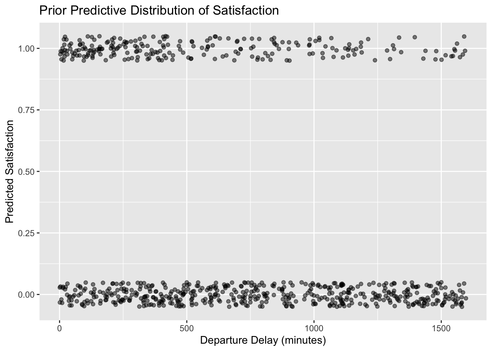
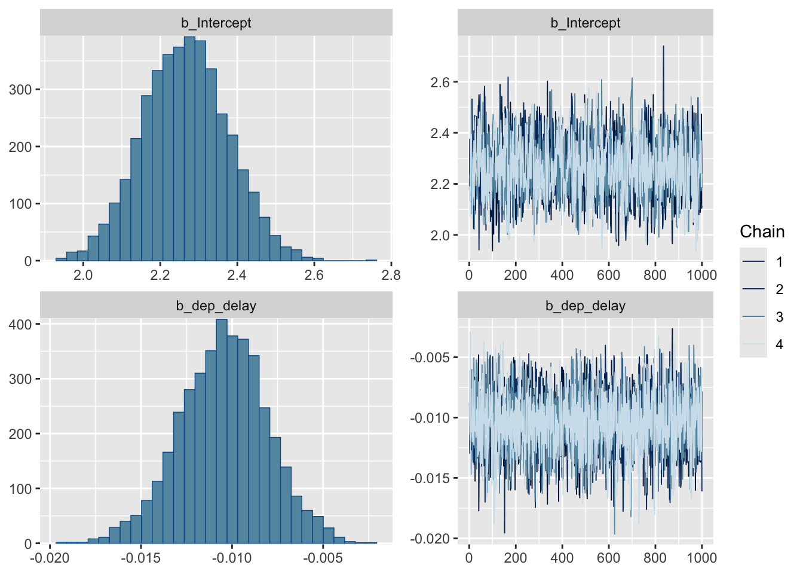
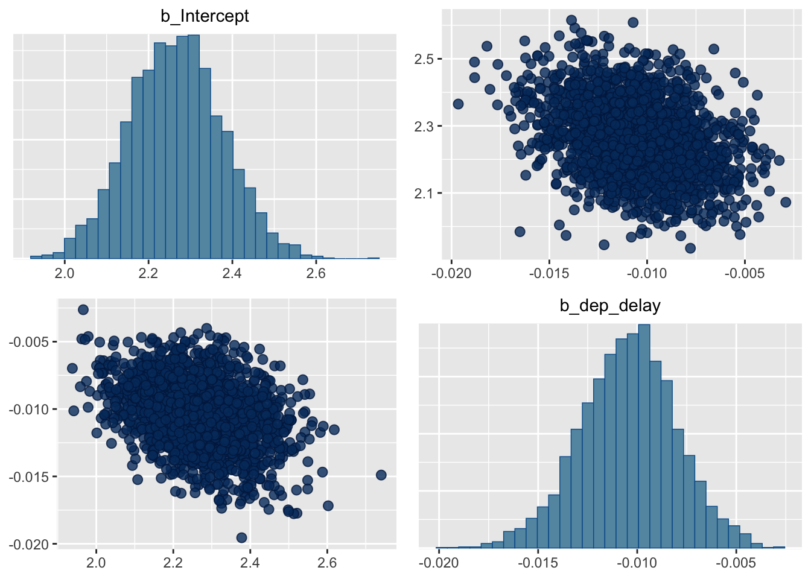
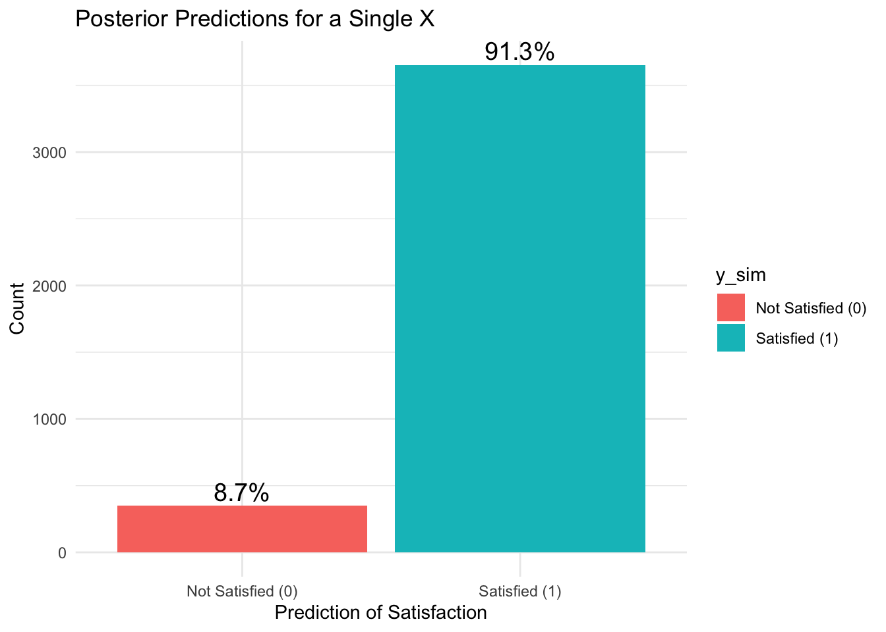
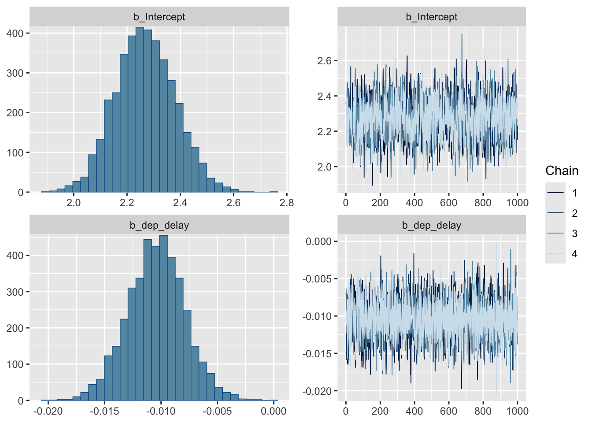
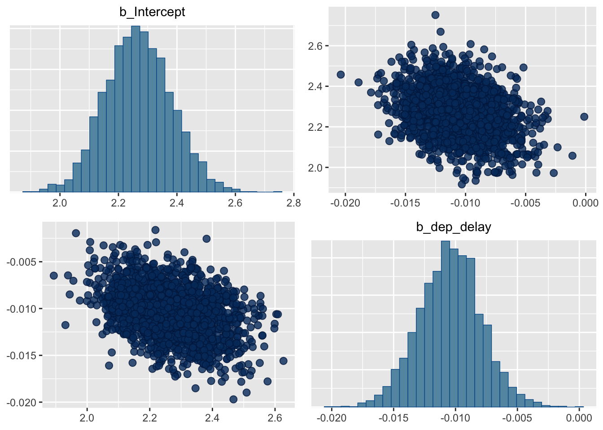

::: {.cell}

```{.r .cell-code}
library(dplyr)
```

::: {.cell-output .cell-output-stderr}
```

Attaching package: 'dplyr'
```
:::

::: {.cell-output .cell-output-stderr}
```
The following objects are masked from 'package:stats':

    filter, lag
```
:::

::: {.cell-output .cell-output-stderr}
```
The following objects are masked from 'package:base':

    intersect, setdiff, setequal, union
```
:::

```{.r .cell-code}
library(tidyverse)
```

::: {.cell-output .cell-output-stderr}
```
── Attaching core tidyverse packages ──────────────────────── tidyverse 2.0.0 ──
✔ forcats   1.0.0     ✔ readr     2.1.5
✔ ggplot2   3.5.1     ✔ stringr   1.5.1
✔ lubridate 1.9.3     ✔ tibble    3.2.1
✔ purrr     1.0.2     ✔ tidyr     1.3.1
```
:::

::: {.cell-output .cell-output-stderr}
```
── Conflicts ────────────────────────────────────────── tidyverse_conflicts() ──
✖ dplyr::filter() masks stats::filter()
✖ dplyr::lag()    masks stats::lag()
ℹ Use the conflicted package (<http://conflicted.r-lib.org/>) to force all conflicts to become errors
```
:::

```{.r .cell-code}
library(ggplot2)
library(brms)
```

::: {.cell-output .cell-output-stderr}
```
Loading required package: Rcpp
Loading 'brms' package (version 2.21.0). Useful instructions
can be found by typing help('brms'). A more detailed introduction
to the package is available through vignette('brms_overview').

Attaching package: 'brms'

The following object is masked from 'package:stats':

    ar
```
:::

```{.r .cell-code}
library(tidybayes)
```

::: {.cell-output .cell-output-stderr}
```

Attaching package: 'tidybayes'

The following objects are masked from 'package:brms':

    dstudent_t, pstudent_t, qstudent_t, rstudent_t
```
:::

```{.r .cell-code}
library(kableExtra)
```

::: {.cell-output .cell-output-stderr}
```

Attaching package: 'kableExtra'

The following object is masked from 'package:dplyr':

    group_rows
```
:::

```{.r .cell-code}
bayes_col = c("#56B4E9", "#E69F00", "#009E73", "#CC79A7", "#CC79A7")
names(bayes_col) = c("prior", "likelihood", "posterior", "prior_predict", "posterior_predict")

bayes_lty = c("dashed", "dotted", "solid")
names(bayes_lty) = c("prior", "likelihood", "posterior")
```
:::


## Research Question and Context

Our research question is how does flight departure delay affect customer satisfaction with a flight? The departure delay time will be measured in minutes and we will determine if it influences whether a customer is satisfied or not satisfied with a flight.

## Data


::: {.cell}

```{.r .cell-code}
airline <- read.csv("/Users/josegarcia/Downloads/airline_data.csv")
airline <- airline %>%
  select(Departure.Delay.in.Minutes, satisfaction) %>%
  rename(dep_delay = Departure.Delay.in.Minutes)
airline <- airline[1:1000,]
airline$satisfaction <- ifelse(airline$satisfaction == "satisfied", 1, 0)
```
:::


We collected data from Kaggle which is a data science platform and online community for data scientists and machine learning practitioners under Google LLC. https://www.kaggle.com/datasets/raminhuseyn/airline-customer-satisfaction

The dataset provides a look into customer satisfaction, either satisfied or not satisfied. The data was collected from an undisclosed airline company. There are 129,880 samples within the dataset, but we will be exploring the first 1,000 samples in the dataset. If the dataset is too big it will have too much influence on the posterior distribution, and our prior will not have any influence.

## Proposed Bayesian Model

Based on the data, we propose a Bayesian analog of a logistic regression which is modeled as:

log($\pi$ / 1 - $\pi$i) = $\beta_0$ + $\beta_1x_j$ .

## Prior Distribution of the Parameters

For our parameters, we chose the following priors:

-   $\beta_0$ (Intercept) \~ N(0, 10)

    -   Prior to seeing the data, we believe the baseline log-odds of satisfaction (when departure delay is zero) could reasonably vary but are centered around zero, reflecting no strong initial bias toward satisfaction or dissatisfaction.

-   $\beta_1$ (Coefficient for Departure Delay) \~ N(0, 2)

    -   We expect that each minute of delay could slightly increase or decrease the probability of satisfaction, but probably not dramatically on a minute-by-minute basis. Therefore, a normal distribution with a smaller standard deviation could make sense, reflecting our belief that substantial changes in odds are unlikely with small changes in delay.


::: {.cell}

```{.r .cell-code}
n_rep = 1000
x = runif(n_rep, 0, 1600)  

# Simulate parameters from the prior distribution
beta0 <- rnorm(n_rep, 0, 10)  
beta1 <- rnorm(n_rep, 0, 2)      

# Simulate values of satisfaction 
p = exp(beta0 + beta1 * x) / (1 + exp(beta0 + beta1 * x))
y_pred = rbinom(n_rep, 1, p)
```

::: {.cell-output .cell-output-stderr}
```
Warning in rbinom(n_rep, 1, p): NAs produced
```
:::

```{.r .cell-code}
# Create a dataframe 
sim_data <- data.frame(dep_delay = x, y_pred = y_pred)

# Plot 
ggplot(sim_data, aes(x = dep_delay, y = y_pred)) + 
  geom_jitter(width = 0.1, height = 0.05, alpha = 0.5) +
  labs(x = "Departure Delay (minutes)", y = "Predicted Satisfaction",
       title = "Prior Predictive Distribution of Satisfaction")
```

::: {.cell-output .cell-output-stderr}
```
Warning: Removed 272 rows containing missing values or values outside the scale range
(`geom_point()`).
```
:::

::: {.cell-output-display}
{width=672}
:::
:::


After some prior predictive tuning, the resulting plot showcases a lower predicted satisfaction for higher values of departure delay, as seen in the greater density of points at 0 (not satisfied).

## BRMS Model


::: {.cell}

```{.r .cell-code}
fit <- brm(data = airline,
           satisfaction ~ dep_delay,
           family = bernoulli(),
           refresh = 0)
```

::: {.cell-output .cell-output-stderr}
```
Compiling Stan program...
```
:::

::: {.cell-output .cell-output-stderr}
```
Start sampling
```
:::
:::


## Posterior Inference


::: {.cell}

```{.r .cell-code}
prior_summary(fit)
```

::: {.cell-output .cell-output-stdout}
```
                prior     class      coef group resp dpar nlpar lb ub
               (flat)         b                                      
               (flat)         b dep_delay                            
 student_t(3, 0, 2.5) Intercept                                      
       source
      default
 (vectorized)
      default
```
:::

```{.r .cell-code}
summary(fit)
```

::: {.cell-output .cell-output-stdout}
```
 Family: bernoulli 
  Links: mu = logit 
Formula: satisfaction ~ dep_delay 
   Data: airline (Number of observations: 1000) 
  Draws: 4 chains, each with iter = 2000; warmup = 1000; thin = 1;
         total post-warmup draws = 4000

Regression Coefficients:
          Estimate Est.Error l-95% CI u-95% CI Rhat Bulk_ESS Tail_ESS
Intercept     2.27      0.11     2.05     2.48 1.00     1538     1957
dep_delay    -0.01      0.00    -0.02    -0.01 1.00     3736     2295

Draws were sampled using sampling(NUTS). For each parameter, Bulk_ESS
and Tail_ESS are effective sample size measures, and Rhat is the potential
scale reduction factor on split chains (at convergence, Rhat = 1).
```
:::

```{.r .cell-code}
plot(fit)
```

::: {.cell-output-display}
{width=672}
:::

```{.r .cell-code}
pairs(fit)
```

::: {.cell-output-display}
{width=672}
:::
:::

::: {.cell}

```{.r .cell-code}
ci <- posterior_summary(fit, probs = c(0.025, 0.975))
print(ci)
```

::: {.cell-output .cell-output-stdout}
```
                 Estimate   Est.Error          Q2.5         Q97.5
b_Intercept    2.26584260 0.110539397    2.04993705  2.483388e+00
b_dep_delay   -0.01045884 0.002421612   -0.01549348 -5.631161e-03
Intercept      2.17275897 0.105025996    1.97113005  2.381407e+00
lprior        -2.36687395 0.038906042   -2.44568717 -2.293818e+00
lp__        -332.36737353 0.976154022 -334.94314056 -3.314080e+02
```
:::
:::


## Posterior Predictive Distribution


::: {.cell}

```{.r .cell-code}
y_predict = posterior_predict(fit)
y_predict = data.frame(y_sim = y_predict[, 1])

# Create the labels
y_predict$y_sim <- factor(y_predict$y_sim, levels = c(0, 1), labels = c("Not Satisfied (0)", "Satisfied (1)"))

# Create summary for percentages
summary <- y_predict |>
  group_by(y_sim) |>
  summarise(Count = n()) |>
  mutate(Percentage = paste0(round(100 * Count / sum(Count), 1), "%"))

# Bar plot
ggplot(summary, aes(x = y_sim, y = Count, fill = y_sim)) +
  geom_bar(stat = "identity") +
  geom_text(aes(label = Percentage), vjust = -0.3, size = 5) +
  labs(title = "Posterior Predictions for a Single X",
       x = "Prediction of Satisfaction", 
       y = "Count") +
  theme_minimal()
```

::: {.cell-output-display}
{width=672}
:::
:::


The bar plot showing the posterior predictions from a logistic regression model indicates a strong skew towards predicting satisfaction, with about 91.7% of outcomes favoring satisfaction and only 8.3% not. This distribution suggests possible overconfidence or overfitting, where the model might be too finely tuned to the data, potentially failing to capture less frequent outcomes of dissatisfaction accurately.

## Sensitivity Analysis


::: {.cell}

```{.r .cell-code}
fit_prior <- brm(data = airline,
           satisfaction ~ dep_delay,
           family = bernoulli(),
           prior = c(prior(normal(0, 10), class = Intercept),
                prior(normal(0, 2), class = b)),
           refresh = 0)
```

::: {.cell-output .cell-output-stderr}
```
Compiling Stan program...
```
:::

::: {.cell-output .cell-output-stderr}
```
Start sampling
```
:::
:::

::: {.cell}

```{.r .cell-code}
summary(fit_prior)
```

::: {.cell-output .cell-output-stdout}
```
 Family: bernoulli 
  Links: mu = logit 
Formula: satisfaction ~ dep_delay 
   Data: airline (Number of observations: 1000) 
  Draws: 4 chains, each with iter = 2000; warmup = 1000; thin = 1;
         total post-warmup draws = 4000

Regression Coefficients:
          Estimate Est.Error l-95% CI u-95% CI Rhat Bulk_ESS Tail_ESS
Intercept     2.27      0.11     2.06     2.49 1.00     1762     2272
dep_delay    -0.01      0.00    -0.02    -0.01 1.00     3833     2579

Draws were sampled using sampling(NUTS). For each parameter, Bulk_ESS
and Tail_ESS are effective sample size measures, and Rhat is the potential
scale reduction factor on split chains (at convergence, Rhat = 1).
```
:::

```{.r .cell-code}
plot(fit_prior)
```

::: {.cell-output-display}
{width=672}
:::

```{.r .cell-code}
pairs(fit_prior)
```

::: {.cell-output-display}
{width=672}
:::

```{.r .cell-code}
pairs(fit_prior)
```

::: {.cell-output-display}
{width=672}
:::
:::

::: {.cell}

```{.r .cell-code}
ci <- posterior_summary(fit_prior, probs = c(0.025, 0.975))
print(ci)
```

::: {.cell-output .cell-output-stdout}
```
                 Estimate   Est.Error          Q2.5         Q97.5
b_Intercept    2.26832313 0.112198112    2.06061281  2.490225e+00
b_dep_delay   -0.01042323 0.002534094   -0.01537322 -5.497751e-03
Intercept      2.17555636 0.106469700    1.97702019  2.388921e+00
lprior        -4.85734562 0.002325193   -4.86215842 -4.853156e+00
lp__        -334.91788853 1.055440182 -337.79547588 -3.339002e+02
```
:::
:::


After setting our own priors for our model, we got results that we the same. The \$\\beta_0\$ value was the exact same of 2.27. The \$\\beta_1\$ values or the slope, were the exact same at -0.01. The 95% credible interval for the intercept is approximately \[2.06, 2.48\], indicating that we are 95% confident that the true intercept lies within this range. This was pretty much the same as the 95% confidence interval for brm's priors that was \[2.06, 2.49\]. The 95% credible interval for \`dep_delay\` is approximately \[-0.016, -0.006\], there is a 95% probability that the true value from dep_delay is within the interval. This is sightly different from the 95% credible interval for brm's priors that was \[-0.010, 0.003\]. This is probably because brm chose a flat prior for the slope, but we picked one that included some prior knowledge on the slope. Overall, the prior had very little influence on the posterior distribution. So the model is not very sensitivity to the prior.

## Frequentist Analysis


::: {.cell}

```{.r .cell-code}
# Fit the logistic regression model
fit_glm <- glm(satisfaction ~ dep_delay, family = binomial(link = "logit"), data = airline)

# Summarize the model
summary(fit_glm)
```

::: {.cell-output .cell-output-stdout}
```

Call:
glm(formula = satisfaction ~ dep_delay, family = binomial(link = "logit"), 
    data = airline)

Coefficients:
            Estimate Std. Error z value Pr(>|z|)    
(Intercept)  2.26440    0.11071  20.454  < 2e-16 ***
dep_delay   -0.01031    0.00243  -4.243 2.21e-05 ***
---
Signif. codes:  0 '***' 0.001 '**' 0.01 '*' 0.05 '.' 0.1 ' ' 1

(Dispersion parameter for binomial family taken to be 1)

    Null deviance: 676.14  on 999  degrees of freedom
Residual deviance: 658.03  on 998  degrees of freedom
AIC: 662.03

Number of Fisher Scoring iterations: 4
```
:::
:::

::: {.cell}

```{.r .cell-code}
# Calculate confidence intervals
confint(fit_glm)
```

::: {.cell-output .cell-output-stderr}
```
Waiting for profiling to be done...
```
:::

::: {.cell-output .cell-output-stdout}
```
                  2.5 %       97.5 %
(Intercept)  2.05331858  2.487825431
dep_delay   -0.01523186 -0.005648149
```
:::

```{.r .cell-code}
# Predict the probabilities of customer satisfication
predicted_probs <- predict(fit_glm, type = "response")
```
:::


After doing a frequentist analysis of our logistical regression model, we got similar results. The $\beta_0$ values were very similar, it was 2.27 for the Bayes Analysis and 2.26 for the frequentist analysis. The $\beta_1$ values or the slope, were the exact same at -0.01. The confidence interval for the intercept is \[2.053, 2.488\]. This means we are 95% of the sample intervals will capture the true intercept. The confidence interval for \`dep_delay\` is \[-0.0152, -0.005\], suggesting a negative association with the probability of a customer association. They produce similar intervals that are interpreted differently.

## Conclusions

Looking at the posterior estimates for $\beta_0$ and $\beta_1$, the estimate for $\beta_0$ is 2.27 and $\beta_1$ is -0.01. The 95% credible interval for the intercept is approximately \[2.06, 2.49\], indicating that we are 95% confident that the true intercept lies within this range. The 95% credible interval for \$\\beta_1\$ is approximately \[-0.010, 0.003\], there is a 95% probability that the true value from dep_delay is within the interval. This means that there is a slight negative association with the departure delay and the probability of a customer being satisfied. $\beta_1$ is the log-odds of a passenger being satisfied or not with each additional minute of delay. Our research question was how does flight departure delay affect customer satisfaction with a flight? We found that the negative association tells us that as departure delay increases, the log-odds of a passenger being satisfied is going to decrease.

